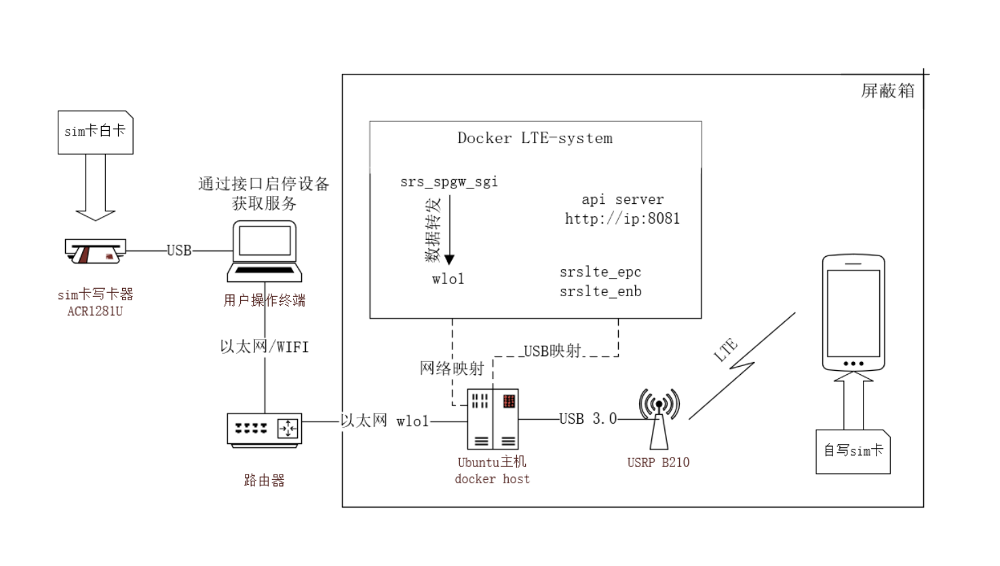
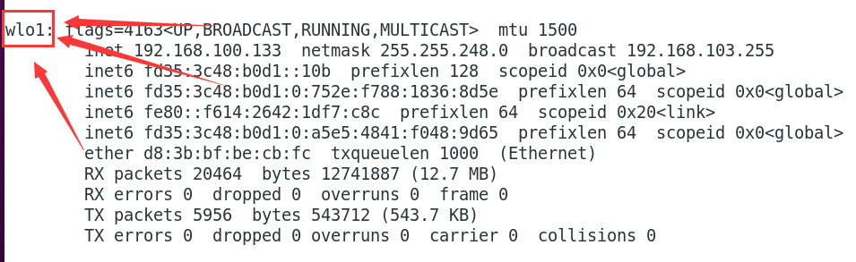
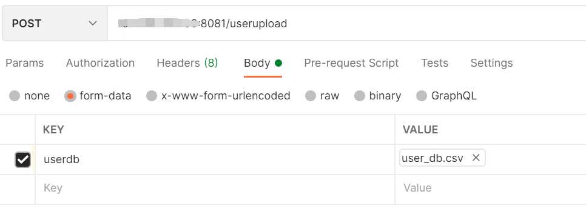
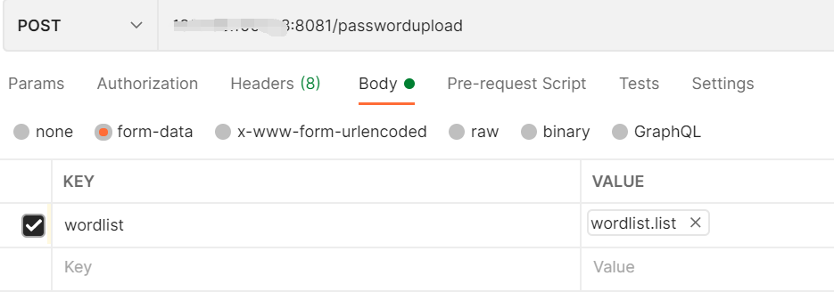
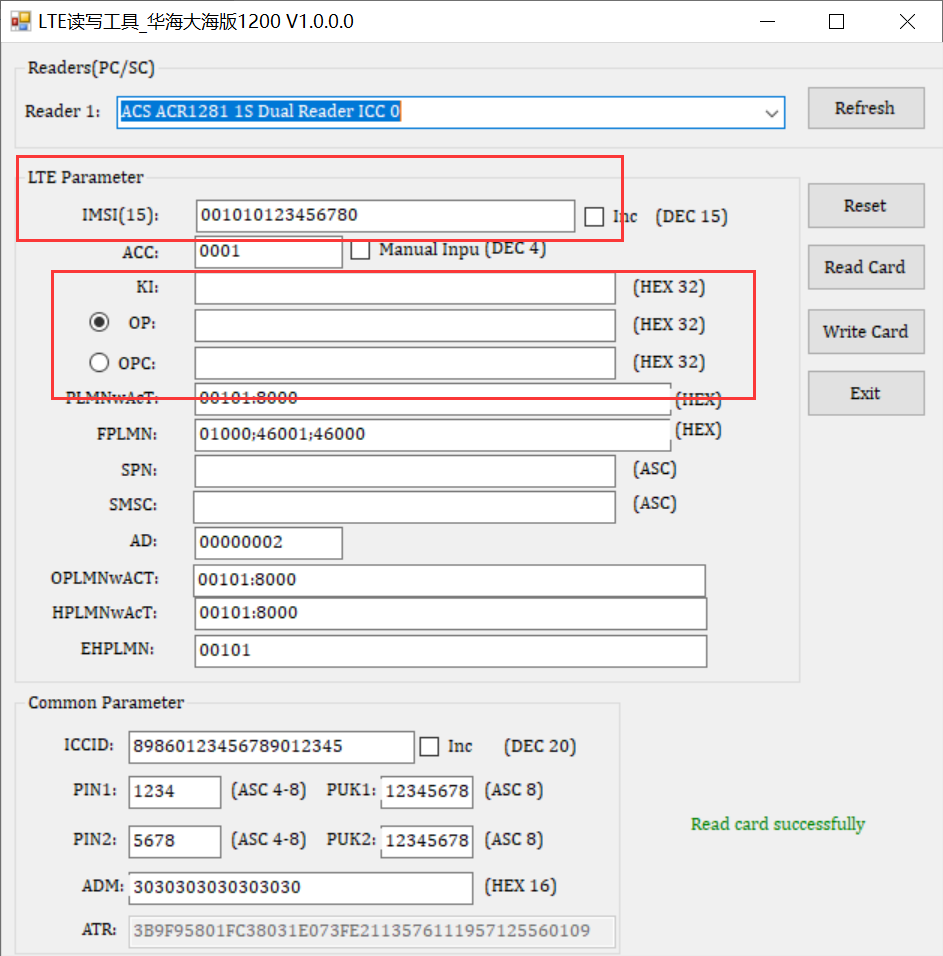

## LTE白卡套件部署与使用

### 研发目的

该LTE-system旨在帮助研究人员快速搭建起一个可用的LTE网络环境环境。

当前公开的LTE伪基站环境搭建方法都比较复杂，使用前需花大量时间去搭建与配置，需要一定基础才能对通信数据进行读取与分析。

使用该系统，可以直接运行起一个完整的LTE网络环境，可以实现以下关键功能：

+ 快速上手，无基础或基础较少人员可以直接使用并获取到部分可用信息，基础较强者，可利用日志文件获取更多信息

+ 快速运行，只需要运行一个docker环境，便可以直接使用

+ 能够结合自写白卡分析LTE设备的流量

+ 能够快速获取到LTE设备的APN,IP等信息

  ---------

  | 功能项       | 类型     | 备注         |
  | ------------ | -------- | ------------ |
  | LTE系统模拟  | 攻击测试 |              |
  | 终端信息获取 | 数据操作 |              |
  | 流量分析     | 数据操作 | 人工抓包解析 |

### 版本更新记录

+ V1.0：初代项目
+ V1.1：增加user_db.csv与wordlist.list上传接口

### 一. 运行环境&设备要求

* 操作系统 : 物理机运行Ubuntu20.04及以上;

* 软件环境 : docker;

* 硬件设备 : USRP B210, LTE白卡,ACR1281U;

* 架构图：

  

### 二. docker镜像部署

完整运行以打包为docker进行，服务开机自启，无需对docker镜像镜像其他操作

* docker镜像已推送至实验室服务器，可以在NERV下直接拉取

```bash
docker pull registry.jiahao.li/addx/srslte:1.1
```

* 容器启动命令

```bash
docker run -dti --privileged --net=host -v /dev/bus/usb:/dev/bus/usb --name=srslte srslte:1.1
```

宿主机USB整体映射到容器之中，已连接USRP B210这一USB设备;

需要与物理机共享网络,这里需要知道物理机的出口网卡,供后续启动LTE设备使用.

### 三. 使用说明

docker环境启动之后，该套件通过API提供服务，目前提供了6个API,均使用POST请求发送,传参和接受参数均使用json格式的数据

```
ipaddress:8081/start # 启动LTE设备
ipaddress:8081/stop # 停止LTE设备
ipaddress:8081/basicinfo # 连接终端设备后获取基础信息
ipaddress:8081/allinfo # 连接终端后获取更多的信息
ipaddress:8081/userupload # user_db.csv文件上传
ipaddress:8081/passwordupload # worldlist.list文件上传 
```

#### 1. start

##### Request Data:

```json
{"band":"0","apn":"skygoapn","mcc":"001","mnc":"01","network":"wlo1"}
```

 - band : LTE基站频段参数,目前支持: 1, 3, 5, 7, 8, 34, 39, 40, 41,若传入参数不在其中,将会默认为band 41

 - apn : Access Point Name,LTE基站接入点名称,可自定义;

 - mcc : 移动国家码,例如中国为 : 460

 - mnc : 移动网络码,例如联通可以使用 : 00,02或04

 - network : 物理机出口接口名称,例如测试设备使用的Wi-Fi,对应网络接口设备为:wlo1

   

##### Response Data

```json
{"status": true, "message_id": 1, "message": "Start successfully"}
```

+ status : 执行结果, 启动成功为true,其他为false

+ message_id : 响应结果id

+ message : 响应信息

+ message_id与message对应关系

  | message_id | message                                              | 备注                          |
  | ---------- | ---------------------------------------------------- | ----------------------------- |
  | 0          | start failed                                         | 未知启动失败,需要查阅日志.    |
  | 1          | start success                                        | 启动成功.                     |
  | 2          | is running                                           | 设备正在运行中.               |
  | 3          | Incomplete parameters                                | 参数不全,请检查参数.          |
  | 4          | device is not connected, please connect usrp device. | USRP B210未连接,请连接后重试. |

##### 注意事项
+ 启动设备需要一定时间,响应时间需要6秒以上秒钟,请注意;
+ 发送请求并收到status为true响应之后,可以使用终端设备使用自己写入的白卡进行连接,白卡的参数需要和LTE配置文件中的对应,后续会进行说明;
+ 若连接多个设备,仅第一个设备能联网,其他设备可以连接至基站,但无法联网,推荐只连接一个设备.


#### 2. stop

##### Request

​	stop不需要传入参数

##### Response

```
{"status": true, "message_id": 1, "message": "Stop successfully."}
```

+ status : 执行结果, 停止成功为true,其他为false

+ message_id : 响应结果id

+ message : 响应信息

+ message_id与message对应关系

| message_id | message      | 备注                      |
| ---------- | ------------ | ------------------------- |
| 0          | stop failed  | 关闭设备失败,需要查阅日志 |
| 1          | stop success | 关闭设备成功              |
| 2          | not running  | 程序未在运行在,无需关闭   |

#### 3. basicinfo

##### Request

该请求无需参数

##### Response

```
{"status": true, "message_id": 1, "message": "Getting information success.", "apn": "skygoapn", "imsi":
"001010123456780", "ip": "172.16.0.2"}
```

+ status : 执行结果, 成功获取到信息为true,其他为false

+ message_id : 响应结果id

+ message : 响应信息

+ apn : 获取到的终端设备apn,无设备为NULL

+ imsi : 获取到的终端设备的imsi,无设备则为NULL

+ ip : 获取到终端的ip

+ message_id与message对应关系

  | message_id | message                            | 备注                                |
  | ---------- | ---------------------------------- | ----------------------------------- |
  | 0          | Failed                             | 未知原因错误,需要手动查找日志       |
  | 1          | Getting information success        | 获取信息成功                        |
  | 2          | Is not running, please start first | 设备未运行,此请求需要设备运行时获取 |
  | 3          | no UE connect                      | 未发现终端设备                      |

##### 注意事项
​	此功能需要在设备运行时运行,若未运行,会有响应提示,目前只能获取第一个设备的信息

#### 4. allinfo

#####  Request

​	此功能无需参数

##### Response

``` 
{"status": true, "message_id": 1, "message": "Getting information success.", "apn": "skygoapn", "imsi":
"001010123456780", "ip": "172.16.0.2", "username": "mi6test", "password": "cmwap"}
```

+ status : 执行结果, 成功获取到信息为true,其他为false

+ message_id : 响应结果id

+ message : 响应信息

+ apn : 获取到的终端设备apn,无设备为NULL

+ imsi : 获取到的终端设备的imsi,无设备则为NULL

+ ip : 获取到终端的ip,未获取到为NULL

+ username : 获取到的终端设备的username,未获取到为NULL

+ password : 获取到的终端设备的password,未获取到为BULL

+ message_id与message对应关系

  | message_id | message                                                      | 备注                                                    |
  | ---------- | ------------------------------------------------------------ | ------------------------------------------------------- |
  | 0          | Failed                                                       | 未知原因错误,需要手动查找日志                           |
  | 1          | Getting information success                                  | 获取信息成功                                            |
  | 2          | Can not get UE's data, please start first and connect UE, or just connect UE. Then try again. | 停止运行时,没有终端设备连接,无法获取到信息              |
  | 3          | Can not get username and password                            | 获取到了基础信息,但无法得到username和password           |
  | 4          | Can not get password from the dict                           | 能够获取到所有信息,但无法使用hash擦头从字典中爆破出密码 |
  | 5          | Stop program failed, please try to stop manually.            | 关闭设备失败,无法进入获取信息流程,需要手动查阅日志.     |

##### 注意事项

+ 执行该操作,会先关闭LTE设备,在读取信息,请注意.
+ 同basicinfo,只能获取到第一个连接至设备的终端设备信息,推荐只连接一个终端设备.
+ 直接获取到的信息,密码为hash,需要使用hashcat和字典进行爆破,字典导入方式请参考passwordupload接口使用方法
#### 5. userupload

#####  Request	

##### Response

``` 
{"status": true, "message_id": 1, "message": "upload success"}
```

+ status : 执行结果, 上传成功为true,其他为false

+ message_id : 响应结果id

+ message : 响应信息

+ message_id与message对应关系

  | message_id | message        | 备注         |
  | ---------- | -------------- | ------------ |
  | 0          | upload failed  | 上传失败     |
  | 1          | upload success | 上传成功     |
  | 2          | no file        | 上传文件为空 |
##### 注意事项
	user_db.csv格式请参考项目文件

#### 6. passwordupload

#####  Request

​	

##### Response

``` 
{"status": true, "message_id": 1, "message": "upload success"}
```

+ status : 执行结果, 上传成功为true,其他为false

+ message_id : 响应结果id

+ message : 响应信息
+ message_id与message对应关系

  | message_id | message        | 备注         |
  | ---------- | -------------- | ------------ |
  | 0          | upload failed  | 上传失败     |
  | 1          | upload success | 上传成功     |
  | 2          | no file        | 上传文件为空 |
##### 注意事项
worldlist.list格式请参考项目文件

### 四. 写卡方法

#### docker配置文件

写入电话卡的参数,需要位于docker中的`/home/workspace/user_db.csv`中,否则无法连接至LTE基站,目前内部数据如下,如有需求请通过userupload接口上传自定义文件

```
#                                                                                           
# .csv to store UE's information in HSS                                                     
# Kept in the following format: "Name,Auth,IMSI,Key,OP_Type,OP/OPc,AMF,SQN,QCI,IP_alloc"  
#                                                                                           
# Name:     Human readable name to help distinguish UE's. Ignored by the HSS                
# Auth:     Authentication algorithm used by the UE. Valid algorithms are XOR               
#           (xor) and MILENAGE (mil)                                                        
# IMSI:     UE's IMSI value                                                                 
# Key:      UE's key, where other keys are derived from. Stored in hexadecimal              
# OP_Type:  Operator's code type, either OP or OPc                                          
# OP/OPc:   Operator Code/Cyphered Operator Code, stored in hexadecimal                     
# AMF:      Authentication management field, stored in hexadecimal                          
# SQN:      UE's Sequence number for freshness of the authentication                        
# QCI:      QoS Class Identifier for the UE's default bearer.                               
# IP_alloc: IP allocation stratagy for the SPGW.                                            
#           With 'dynamic' the SPGW will automatically allocate IPs                         
#           With a valid IPv4 (e.g. '172.16.0.2') the UE will have a statically assigned IP.
#                                                                                           
# Note: Lines starting by '#' are ignored and will be overwritten                           
ue2,mil,001010123456780,00112233445566778899aabbccddeeff,opc,63bfa50ee6523365ff14c1f45f88737d,8000,0000000030c8,7,dynamic
ue1,xor,001010123456789,00112233445566778899aabbccddeeff,opc,63bfa50ee6523365ff14c1f45f88737d,9001,000000001234,7,dynamic
ue3,mil,001012333333333,00112233445566778899aabbccddeeff,opc,63bfa50ee6523365ff14c1f45f88737d,8001,000000002b12,7,dynamic

```

##### 注意事项：

​	请在最后留一行空格，无责无法正确读取配置

#### 写卡方式

​	写卡需要用到LTE白卡,以及写卡设备,这里使用ACR1281U作为写卡设备

​	主要需要填写的为IMSI,KI,OP或者OPC,这几项需要与user_db.csv的数据对应,其他参数可以根据个人需要进行修改


