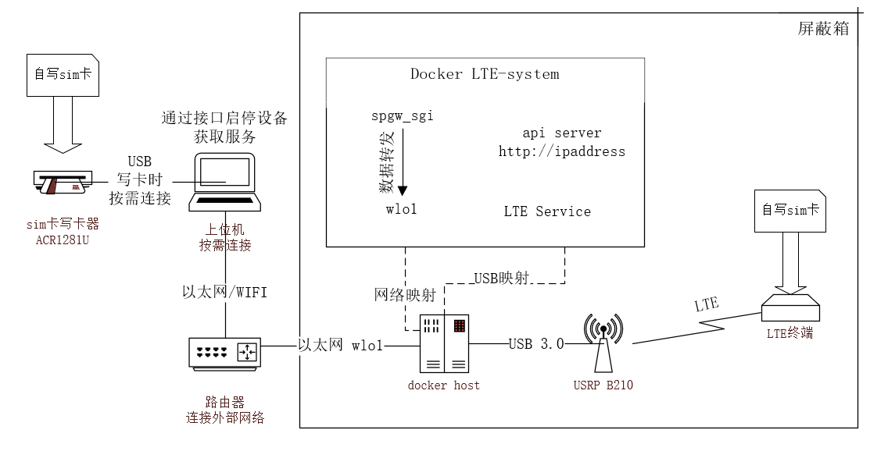

## LTE-System

该系统旨在快速搭建起一个可用的LTE网络环境。

当前公开的LTE环境搭建方法都比较复杂，使用前需花大量时间去搭建与配置，需要一定基础才能对通信数据进行读取与分析。

使用该系统，可以直接运行起一个功能丰富的LTE网络环境，并具备以下特性：

+ 快速上手，无基础或基础较少人员可以直接使用该系统来获取到可用信息，基础较强者，可利用日志文件获取更多信息

+ 快速运行，只需要运行一个docker环境，便可以直接使用

+ 能够结合自写白卡分析LTE设备的流量

+ 能够快速获取到LTE设备的APN,IP等信息

+ 支持设备简单，USRP即可

  

### 系统架构

### 系统功能

docker环境启动之后，该套件通过API提供服务，提供多种功能

| 功能点           | 描述                                                         |
| ---------------- | ------------------------------------------------------------ |
| 自定义配置       | 可自定义配置并启动系统，如band、apn、mcc、mnc等信息，且只需给定频段编号，系统便能自动配置频点信息 |
| 基础信息读取     | 可获取附着在系统上的终端设备的imsi、ip等简单信息             |
| 高级信息读取     | 除imsi、ip外，还能获取到终端设备的apn用户名与密码数据，并通过爆破获取到apn的明文密码 |
| 自定义SIM卡      | 可上传自定义SIM卡配置实现使用自定义sim卡接入该系统           |
| 字典上传         | 可上传自定义字典文件，供爆破终端设备的apn明文密码使用        |
| 数据流量抓取     | 可通过该系统获取到附着在该设备上的LTE上网流量，以便对流量进行后续分析 |
| 通信协议流量抓取 | 可通过该系统获取到LTE通信协议数据包供专业人士进行分析        |

